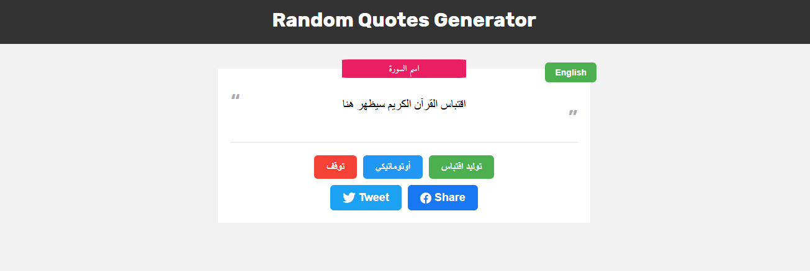

# Quote Generator – Inspirational Quotes in English & Arabic

A dynamic web application that generates inspirational quotes in both English and Arabic, allowing users to share their favorite quotes directly on social media platforms.

🌐 **Live Demo**: [https://amelchenni.github.io/Quote-Generator/](https://amelchenni.github.io/Quote-Generator-App/)

---

## 🚀 Features
- Generate inspirational quotes in **English** and **Arabic**.  
- Share quotes easily on social media platforms (Twitter, Facebook, etc.).  
- Simple, clean, and responsive UI design.  

---

## 🛠️ Technologies Used
- **JavaScript** – For generating and handling quotes dynamically.  
- **HTML5 & CSS3** – For layout, styling, and responsiveness.  

---

## 📌 About the Project
This project was developed as part of the course "**إنشاء 50 تطبيق عملي على لغة جافاسكربت**" by **Osama Elzero**, aiming to boost practical JavaScript and front-end development skills.

---

## 📌 Future Improvements
- Add more categories and types of quotes.  
- Implement user customization (e.g., font size, background colors).  
- Store favorite quotes locally for easy access.  
- Enhance social sharing options with more platforms.  

---

## 📷 Preview

